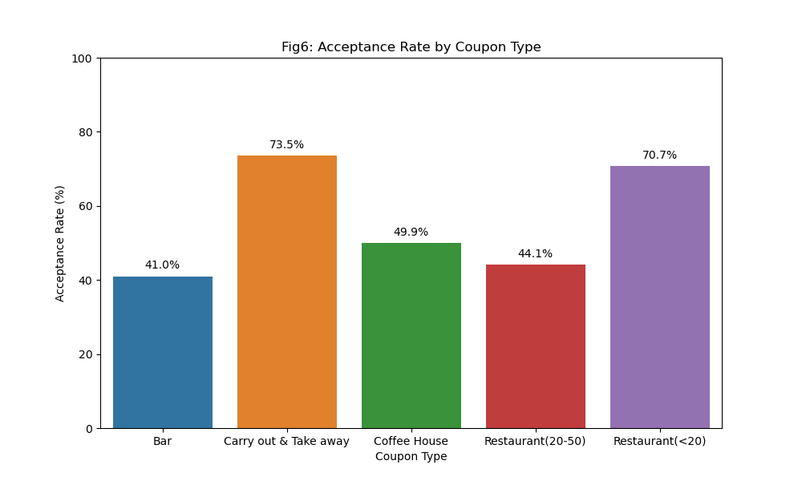
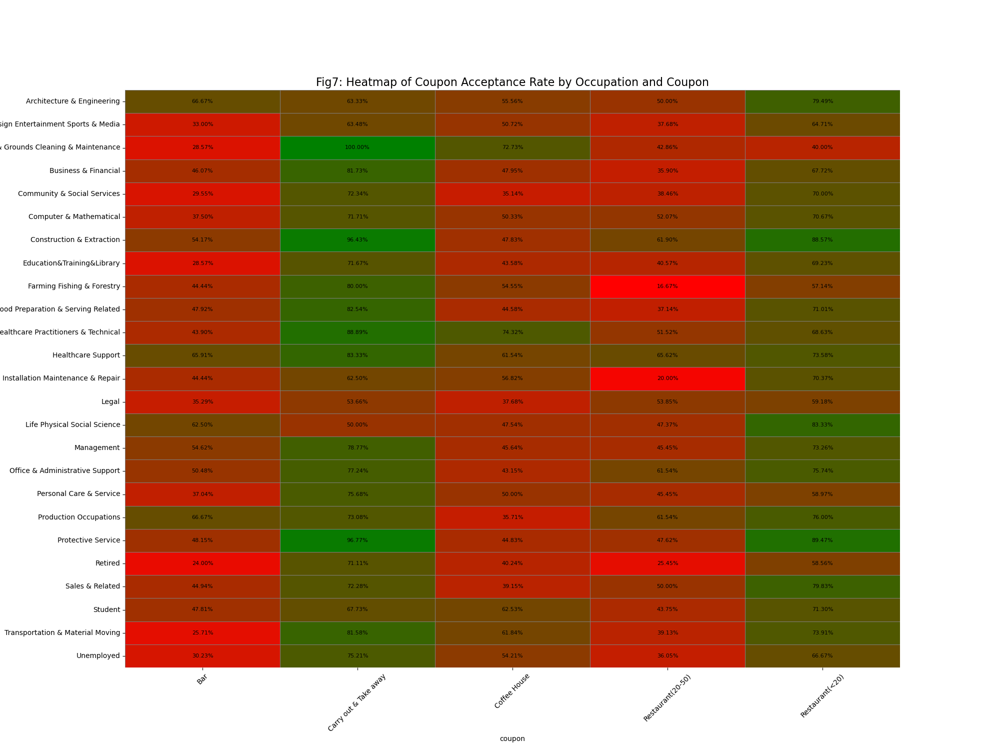
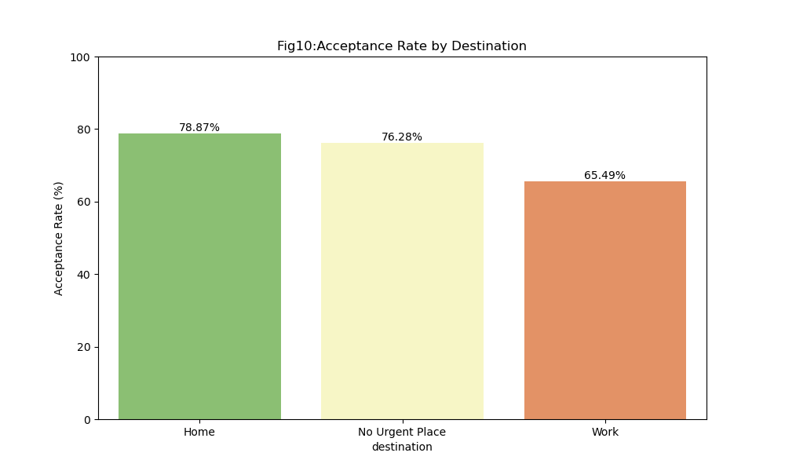

### Coupon Data Exploration

**Source**

This description and the initial prompt Jupyter notebook are from the Berkeley Haas Professional Certificate in Machine Learning and Artificial Intelligence program.  This is Assignment 5.1.  Here is a link to [information about the program](https://em-executive.berkeley.edu/professional-certificate-machine-learning-artificial-intelligence).

The jupyter notebook with the source and instructions is available [here](coupondata.ipynb).

### Assignment: Will a Customer Accept the Coupon?

**Context**

Imagine driving through town and a coupon is delivered to your cell phone for a restaraunt near where you are driving. Would you accept that coupon and take a short detour to the restaraunt? Would you accept the coupon but use it on a sunbsequent trip? Would you ignore the coupon entirely? What if the coupon was for a bar instead of a restaraunt? What about a coffee house? Would you accept a bar coupon with a minor passenger in the car? What about if it was just you and your partner in the car? Would weather impact the rate of acceptance? What about the time of day?

Obviously, proximity to the business is a factor on whether the coupon is delivered to the driver or not, but what are the factors that determine whether a driver accepts the coupon once it is delivered to them? How would you determine whether a driver is likely to accept a coupon?

**Overview**

The goal of this project is to use this data to distinguish between customers who accepted a driving coupon versus those that did not.

**Data**

This data comes to us from the UCI Machine Learning repository and was collected via a survey on Amazon Mechanical Turk. The survey describes different driving scenarios including the destination, current time, weather, passenger, etc., and then ask the person whether he will accept the coupon if he is the driver. Answers that the user will drive there ‘right away’ or ‘later before the coupon expires’ are labeled as ‘Y = 1’ and answers ‘no, I do not want the coupon’ are labeled as ‘Y = 0’.  There are five different types of coupons -- less expensive restaurants (under $20), coffee houses, carry out & take away, bar, and more expensive restaurants ($20 - $50). 

## Analysis of Bar Coupons ##

41% of bar coupons were accepted.  We delved into the factors which might influence this decision and found...

1.  Drivers who visit bars more than 3 times per month are much more likely to accept a bar coupon

* More than 3 visits to a bar per month: 78.0%
* 3 or fewer visits to a bar per month: 37.1%

2. Widening the selection to include those who visit once or more per month and constraining it to those over 25 reduced this difference

* Visit a bar more than once per month and are over 25: 67.0%
* All Others: 38.5%

3. More constrained selections did not increase the difference, implying that the number of visits is highly determinant of coupon acceptance.

* Visit a bar more than once per month, had non-kid passengers, and not in farming, fishing, or forestry: 67.3% versus all Others: 34.5%

* (Bar > 1x/month, non-kid passengers, not widowed) OR (Bar > 1x/month, under 30) OR (Cheap restaurant > 4x/month, income < $50k): 56.9% versus all Others: 33.2%

## Invesigating other coupon types ##

### Which coupon types are most likely to be accepted? ###

As shown above, Carry Out & Take Away coupons are the most accepted, at 73.5%.

We sought to understand which particular driver and environmental factors made acceptance of these coupons most likely.

### Acceptance by occupation

Clearly there is a strong difference even within coupon types between drivers with different occupations.  Looking specifically at Carry out coupons, we asked "which occupations are most likely to accept the coupon"?

This shows a strong variance (approximately 50%) between occupations for the same type of coupon.

## Does the weather influence coupon acceptance?

The weather is a smaller predictor of coupon acceptance than profession but still signficant.

## Are drivers more likely to accept Carry out coupons when driving home?

Drivers are more likely to accept when driving home, than when driving to work (14% difference).

## Is age a big factor in acceptance of Carry out coupons?

Age does not seem to be a strong factor in acceptance or rejection of carry out coupons.

## Who are the most likely drivers to accept a carry out coupon?
We found that that selecting a subset of drivers based on weather, destination and occupation, we identified a high likelihood target segment (94.9%) - these are drivers on sunny daysm driving home, from occupations which are often on a job site or outside (i.e. not in an office).

## Conjecture

Drivers will be most amenable to coupons which fill a need they already have, at a time they need it, when it is convenient.  The weather impact speaks to convenience.  The need is shown by the destination of home - when heading home, drivers are more likely to need to pick up dinner.  Finally, the occupations which require drivers to be away from a single location (office cafeteria for example) are more likely to have to get food elsewhere.  Quite often there may be time constraints which make Carry out more convenient.

